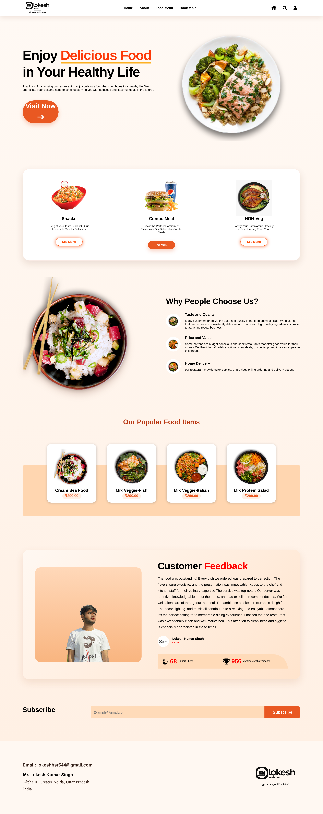

# 🍽️ Restaurant Website

A responsive and visually appealing **Restaurant Website** built using **HTML, CSS, and JavaScript**. The project provides a clean interface for customers to explore the restaurant, view the menu, learn about the restaurant, and book a table.

## 🌐 Live Demo

🔗 **Live Demo:** https://restaurant-website-v2-nu.vercel.app/

🔗 **GitHub Repository:**
https://github.com/lokeshkumar72/Resturant_website

---

## 📸 Screenshots

### 🏠 Home Page



### 🍴 Menu Page


### ℹ️ About Page


### 📅 Booking Page


> Add these screenshots to your `images` folder and update the filenames above if your actual screenshot names are different.

---

## ✨ Features

* 🏠 Attractive and responsive home page
* 🍽️ Restaurant menu section
* 👨‍🍳 Chef and restaurant information
* 📖 About Us page
* 📅 Table booking page
* 📱 Responsive design for different screen sizes
* 🎨 Clean and modern user interface
* 🖼️ Food and restaurant image sections
* 🔗 Social media and navigation links
* ⚡ Lightweight frontend website

---

## 🛠️ Technologies Used

| Technology       | Purpose                       |
| ---------------- | ----------------------------- |
| **HTML5**        | Website structure             |
| **CSS3**         | Styling and responsive design |
| **JavaScript**   | Interactive functionality     |
| **Font Awesome** | Icons                         |

---

## 📂 Project Structure

```text
Resturant_website/
│
├── favicon_io/
│
├── images/
│   ├── ...
│
├── About.html
├── About.css
├── book.html
├── index.html
├── menu.html
├── style.css
├── app.js
│
└── README.md
```

The repository currently uses separate HTML pages for the home, about, menu, and booking sections, with CSS and JavaScript files supporting the interface.

---

## 📄 Pages

### 🏠 Home

The homepage introduces the restaurant and provides navigation to the major sections of the website.

### ℹ️ About

The About page provides information about the restaurant and its chefs.

### 🍴 Menu

The menu page showcases different food items and restaurant offerings.

### 📅 Booking

The booking page provides a dedicated interface for customers to book a table.

---

## 📱 Responsive Design

The website is designed with responsive layouts so that the interface can adapt to:

* 💻 Desktop
* 💻 Laptop
* 📱 Tablet
* 📱 Mobile devices

CSS media queries and flexible layouts are used to improve the experience across different screen sizes.

---

## 🚀 Getting Started

### 1. Clone the Repository

```bash
git clone https://github.com/lokeshkumar72/Resturant_website.git
```

### 2. Open the Project

```bash
cd Resturant_website
```

### 3. Run the Website

Open `index.html` in your browser.

For development, you can also use the **Live Server** extension in Visual Studio Code.

---

## 🎯 What I Learned

Through this project, I practiced:

* Building multi-page websites with HTML
* Creating responsive layouts with CSS
* Using CSS Flexbox and media queries
* Adding icons with Font Awesome
* Using JavaScript for frontend interactions
* Organizing website assets and files
* Designing user-friendly navigation
* Building responsive restaurant UI

---

## 🔮 Future Improvements

Planned improvements for future versions include:

* 🛒 Online food ordering
* 🛍️ Shopping cart functionality
* 📅 Functional table reservation system
* 💳 Online payment integration
* 📧 Backend-powered contact form
* 🔐 User authentication
* ⭐ Customer reviews and ratings
* 🗄️ Database integration
* 📊 Restaurant admin dashboard

---

## 👨‍💻 Author

### Lokesh Kumar Singh

**Frontend / Full-Stack Developer**

* 💻 GitHub: [lokeshkumar72](https://github.com/lokeshkumar72)
* 💼 LinkedIn: [Lokesh Kumar Singh](https://www.linkedin.com/in/lokesh-kumar-singh-/)
* 📸 Instagram: [@gitpush_with.lokesh](https://www.instagram.com/gitpush_with.lokesh/)

---

## ⭐ Support

If you find this project useful or interesting, consider giving the repository a ⭐ on GitHub.

---

## 📄 License

This project was created for **learning and portfolio purposes**.
